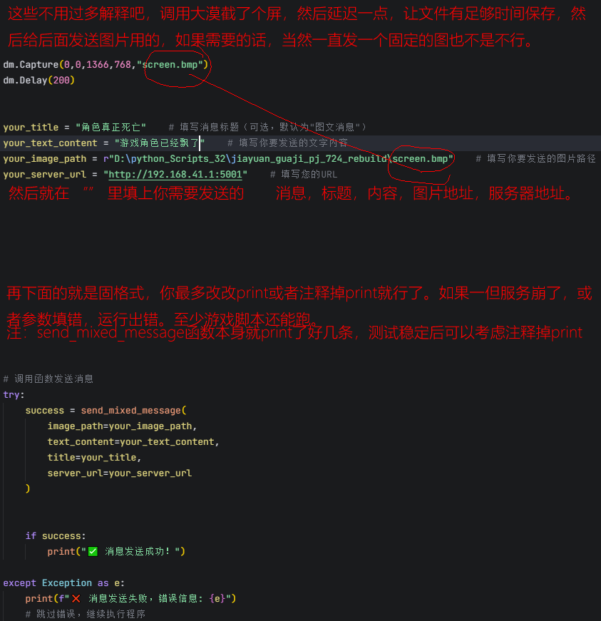

# 通知系统

一个简洁的通知系统，包含服务端和PC客户端，支持文本、图片和图文混排消息的发送和接收。
个人水平稀烂，不要指望程序功能有多完美，比如消息全是从服务端拉过来的，断连就一条都显示不出来，
删除消息得保证服务器和客户端都在线，不然会变成什么样我也不太清楚。
如果怕文件量太大，定期删除客户端的saved_images文件夹，和服务端的messages.db，都直接删就行，文件没了会重建的。

从架构开始的介绍基本上都不可能太准了。全是用AI折腾出来的。。

就是个简单的通知系统，服务端接收消息，客户端显示消息。消息保存在服务端，运行后会自己建数据库的，每10天还是30天自己清数据库，具体多少天记不清了，有能力的自己看代码

暂时这东西算是能用了，等我自己慢慢用，慢慢改吧，github我基本上就是不会用，都在网页端传上来的，这些个缓冲问题，会不会导致代码无效，我也不知道了。

python3.8的32位版，我其实是个写游戏脚本的，DDDD。。。

用法，
## 服务端：
把服务端丢到服务器上，当然本机也能用，直接运行python server.py，就服务端就算启动完了。
X86的WIN系统和X86的ISTOREOS（Ｊ１９００）嵌入式linux系统，我试过了没什么问题。。
让服务端 非独占，后台运行，以及开机运行这些个基本的操作，问AI，让他引导就搞的定。。

至于缺库，按报错提示安装就可以了。能运行了之后退出来，把config.json的IP和端口，改成你自己的。

## 客户端：
*windows:*
同理，直接python main_client.py就行，缺库同理操作。
客户端的config.json，和服务端的配置文件，IP和端口，要一致。
然后，你自己随便打包个EXE就算能用了。

这玩意实现了，和QQ微信一样的托盘闪烁，我在GIT上找了快半年了，就找不到一个能实现的，就自己写了一个。
但是我只闪了图标，没加声音，也许以后会加吧，图标可以自己改，项目目录一眼就能看懂。


客户端 的单条删除和全部清除是能操作到数据库的，会抹掉本地和数据库里的消息。

仅单实例运行，防止重复运行。


simple_test.py，是个测试脚本，我自己用的，换一下IP地址，端口，就可以测试了。
里面的图片地址，自己换一下，上传的时候，图让我删了，直接行运行，我记得是不会报错，因为我记着我是按可以发空白消息写的。

就这样吧，这个测试的ｐｙ，收拾收拾，扔自己的游戏脚本里，就能实现发通知了。

主要场景就是脚本异常啊，游戏里出好东西了啊，人物躺了啊什么的特殊情况，就发个通知出来。
如果发图的话，其实也挺快的，毕竟也就是个游戏截图，但是如果有必要，就开个线程，单独发，不要影响到游戏脚本。
*andriod:*
项目直接传不上来，文件太多，直接打包那个android_client.rar是打包的源文件，等相对稳定，会传relese上来的。
### 2025.8.24
偿试构建安卓客户端
优化一下客户端代码量
优化一些客户端的显示细节
修复：当离线时，移除消息列表，仅单条会提示无法连接服务器器，而全部移除的时候，没有提示，但列表被清了。而这2都其实服务器上的消息都没删除掉


### 2025.8.19
优化一下客户端代码量
优化客户端界面

### 2025.8.18
优化一下客户端代码量，修正保存图片的路径，应为客户端的路径内。而不是在外面


--------------------------------------------------------------------------------------------------------

#### 一个调用例子，尽量使用try写。不然万一出错不至于脚本全崩！

#### 如果有库报错，就自己pip一下，然后import，很基础的库，基本不用考虑版本。
应该就这4个就够，后2个需要pip一下
```
import os       
import sys      
import requests    # 用于发送HTTP请求
import base64      # 用于图片的base64编码

```

### 把这个函数，放到自己项目里的某个模块中，然后在需要运行的脚本里from...import就能用了。
#### 或者把这个函数，整个复制到你脚本的代码里，然后直接调用。
<1>把函数弄过来
```
    def send_mixed_message(image_path, text_content, title="图文消息", server_url="http://127.0.0.1:5001"):
    """
    发送图文混合消息到服务器
    
    参数:
        image_path (str): 图片文件的完整路径
        text_content (str): 消息的文字内容
        title (str): 消息标题，默认为"图文消息"
        server_url (str): 服务器地址，默认为"http://127.0.0.1:5001"
    
    返回:
        bool: 发送成功返回True，失败返回False
    """
    try:
        # 检查图片文件是否存在
        if not os.path.exists(image_path):
            print(f"❌ 图片文件不存在: {image_path}")
            return False
        
        # 读取图片文件并进行base64编码
        # 'rb'表示以二进制模式读取文件，确保图片数据不会被错误解析
        with open(image_path, 'rb') as f:
            image_content = f.read()  # 读取图片的二进制数据
        
        # 将图片的二进制数据编码为base64字符串
        # base64编码可以将二进制数据转换为文本格式，便于在HTTP请求中传输
        image_base64 = base64.b64encode(image_content).decode('utf-8')
        
        # 构建要发送的消息数据结构
        # 这个字典包含了服务器处理图文消息所需的所有信息
        message_data = {
            "type": "mixed",                              # 消息类型：mixed表示图文混合消息
            "content": text_content,                       # 消息的文字内容
            "title": title,                                # 消息标题，显示在客户端消息列表中
            "image_data": image_base64,                   # 图片的base64编码数据
            "image_name": os.path.basename(image_path)    # 图片文件名，从完整路径中提取
        }
        
        # 向服务器发送POST请求，提交消息数据
        # 使用json参数自动将Python字典转换为JSON格式
        response = requests.post(f"{server_url}/api/messages", json=message_data)
        
        # 打印服务器响应的HTTP状态码
        # 200表示成功，其他状态码表示各种错误
        print(f"发送结果: {response.status_code}")
        
        # 打印服务器返回的响应内容
        # 通常包含消息发送结果和相关信息
        print(f"响应内容: {response.text}")
        
        # 返回发送结果
        return response.status_code == 200
        
    except Exception as e:
        print(f"❌ 发送消息时发生错误: {str(e)}")
        return False
```
<2>在脚本里使用

```
dm.Capture(0,0,1366,768,"screen.bmp")
dm.Delay(200)

your_title = "角色真正死亡"    # 填写消息标题（可选，默认为"图文消息"）
your_text_content = "游戏角色已经飘了。"    # 填写你要发送的文字内容
your_image_path = r"D:\python_Scripts_32\jiayuan_guaji_pj_724_rebuild\screen.bmp"    # 填写你要发送的图片路径
your_server_url = "http://192.168.41.1:5001"    # 填写您的URL


# 调用函数发送消息
try:
    success = send_mixed_message(
        image_path=your_image_path,
        text_content=your_text_content,
        title=your_title,
        server_url=your_server_url
    )

                            
    if success:
        print("✅ 消息发送成功！")

except Exception as e:
    print(f"❌ 消息发送失败，错误信息: {e}")
    # 跳过错误，继续执行程序
```

<3>图解说明


